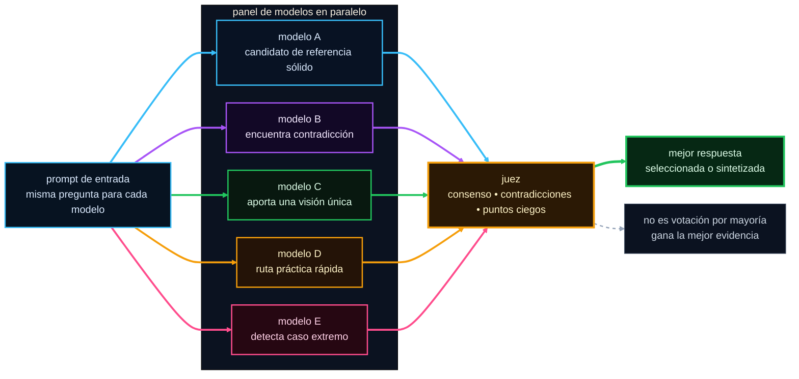

# pi-fusion

[](https://www.npmjs.com/package/@alexeiled/pi-fusion)
[](https://github.com/alexei-led/pi-fusion/actions/workflows/test.yml?query=branch%3Amaster)
[](https://nodejs.org/)
[](./LICENSE)

> Modelos en paralelo. Un juez. Respuestas mejores.

`pi-fusion` es una extensión de Pi para preguntas técnicas complejas.
Envía un único prompt a un pequeño panel de modelos que se ejecutan en paralelo.
Un agente juez compara luego las respuestas y devuelve la más realista.

La CI cubre lint, verificación de tipos, pruebas unitarias, pruebas de integración, pruebas de humo del paquete,
y `npm pack --dry-run`.


## Por qué existe Fusion

Las preguntas complejas a menudo se ven limitadas por la ruta de búsqueda de un solo modelo.
`pi-fusion` intercambia latencia por diversidad:

- el mismo prompt se distribuye a varias ejecuciones de modelos en paralelo
- cada modelo explora el problema desde un prior de entrenamiento y una ruta de razonamiento diferentes
- la superposición aumenta la confianza
- el desacuerdo expone el riesgo
- el juez conserva las partes más sólidas y descarta las débiles, parciales o conflictivas

Esto es selección de evidencia, no votación por mayoría.



## Por qué un panel puede superar a un solo modelo

Las respuestas de un solo modelo son frágiles en tareas complejas. Están limitadas por los priores
de un modelo, una ruta de razonamiento y un modo de fallo.

Un panel ayuda porque:

- los modelos diferentes se entrenan de forma distinta y realizan apuestas diferentes
- los errores están menos correlacionados, por lo que los puntos ciegos no se alinean perfectamente
- el consenso es una señal útil de confianza sin pretender certeza
- el desacuerdo te indica dónde es frágil la respuesta
- un juez puede seleccionar o sintetizar la respuesta más realista del conjunto

El resultado es más lento, pero generalmente mejor para decisiones de diseño, revisiones de riesgo,
depuración compleja y preguntas que requieren mucha investigación. No está destinado a ediciones
rutinarias, formato o correcciones obvias de un solo paso.

## Qué hace realmente el juez

El juez recibe:

- el prompt original
- cada salida del panel
- fallos y puntos ciegos del panel
- el modelo de juez configurado

Luego:

- encuentra consenso
- preserva los desacuerdos reales
- detecta respuestas débiles o incompletas
- rescata visiones únicas que valga la pena conservar
- devuelve una recomendación clara y el siguiente paso

No edita archivos ni genera más subagentes. Hace un solo trabajo: elegir o
sintetizar la respuesta más realista.

## Buena opción

Úsalo para preguntas como:

- ¿Qué diseño elegimos?
- ¿Qué se romperá si cambio esto?
- ¿Es seguro este flujo de PR o de lanzamiento?
- ¿Qué me perdí?
- ¿Cuál es la estrategia de pruebas adecuada aquí?

No lo uses para ediciones triviales, formato o correcciones obvias de un solo paso.

## Comandos

```text
/fusion
/fusion <prompt>
/fusion --profile <name> <prompt>
/fusion --panel <models> <prompt>
/fusion -p <name> <prompt>
/fusion status
/fusion stop
/fusion init
```

## RPC de ejecución de planes

Otras extensiones de Pi pueden controlar Fusion a través del contrato de bus de eventos versionado
`fusion:rpc:v1`:

- emite solicitudes en `fusion:rpc:v1:request`
- escucha la respuesta en `fusion:rpc:v1:reply:<requestId>` antes de emitir
- envía `{ "version": 1, "requestId": "...", "method": "...", "params": {} }`
- recibe `{ "version": 1, "requestId": "...", "method": "...", "success": true, "data": {} }` o un fallo con un `error` tipado

Métodos:

- `ping` — devuelve la versión RPC y los métodos soportados
- `start` — requiere `prompt` y un `operationId` no vacío. Acepta un `profile` opcional. Reutilizar un ID de operación devuelve la ejecución original en lugar de iniciar otra, incluso después de que Fusion restaure el historial de sesiones de Pi.
- `status` — devuelve el estado estructurado de la ejecución por `operationId`, `runId` o la ejecución actual/última
- `result` — devuelve una ejecución terminal y un informe. Una ejecución activa devuelve `not_ready`
- `cancel` — cancela la ejecución activa seleccionada, o informa que la ejecución terminal seleccionada no fue cancelada
- `adopt` — verifica y devuelve una ejecución del historial de sesión restaurado por `runId`

`start` devuelve `{ operationId, replayed, run }`. `status` y `result`
devuelven `{ run }`. `cancel` devuelve `{ cancelled, run? }`. `adopt` devuelve
`{ adopted: true, run }`. El estado de la ejecución contiene `runId`, `operationId` opcional,
`phase`, `terminal`, y `report` o `error` opcionales.

Los códigos de fallo son `invalid_request`, `unsupported_method`, `busy`, `not_found`,
`not_ready`, `unavailable`, `start_failed`, `cancel_failed` e `internal`.
`busy`, `not_ready` y fallos de búsqueda incluyen detalles estructurados cuando están disponibles.

## Inicio rápido

Requisitos:

- Pi
- Node.js 22.19+
- `pi-subagents`

```bash
pi install npm:pi-subagents
pi install npm:@alexeiled/pi-fusion
```

Opcional. Solo necesario si un miembro del panel usa el agente `fusion-panelist-web` o
`fusion-panelist-full`:

```bash
pi install npm:pi-web-providers
```

Luego recarga Pi:

```text
/reload
```

Para detalles sobre comandos, configuración y solución de problemas, consulta [`docs/user-guide.md`](./docs/user-guide.md).

## Notas

- Ejecutar `/fusion` sin argumentos muestra un breve resumen de comandos.
- La configuración es opcional. Los valores predeterminados funcionan. Usa `/fusion init` cuando quieras configuración del proyecto.
- La configuración del proyecto reside en `.pi/fusion.json`. La configuración global reside en `~/.pi/agent/fusion.json`.
- La salida aparece como un mensaje personalizado de Pi. El progreso activo también usa la clave de estado `fusion`.
- Las ejecuciones activas se reconcilian desde los artefactos del ciclo de vida de `pi-subagents`, no solo desde eventos de finalización.
- `pi-fusion` no es propietario del pie de página.
- Fusion envía tu prompt y cualquier fragmento inspeccionado a cada modelo del panel, y al juez, a través de `pi-subagents`.
- Los informes incluyen el tiempo disponible por panel y del juez, tiempo agregado del modelo, uso, costo estimado y detalles de fallos del modelo. El uso del proveedor que falta se muestra como desconocido. `$0.0000` es un costo cero conocido.
- `Model` es metadatos del ciclo de vida. `Configured model` es la solicitud del perfil. Ambos aparecen cuando la ejecución difiere de la solicitud.
- `stopWhenPanelAgrees` es una configuración de perfil opt-in. Requiere registros de decisión de alta confianza coincidentes sin solicitud de más evidencia, detiene solo a los panelistas no terminados y aún ejecuta al juez.
- Las respuestas del panel llegan al juez en un orden inicializado desde el `run id`, no en el orden de configuración. Un orden fijo favorece al mismo miembro en cada ejecución, porque los jueces favorecen al candidato que ven primero o último.
- Los panelistas pueden buscar en la web al optar por el agente `fusion-panelist-web`, lo cual requiere `pi-web-providers`. Los valores predeterminados se mantienen solo locales a propósito: los nombres de las herramientas son una lista de permisos estricta, por lo que un agente que declara una herramienta cuya extensión falta fallará en cada tarea que la use.
- `synthesis: "merge"` cambia de elegir la mejor respuesta a fusionar respuestas que cubrieron diferentes facetas, usando el agente `fusion-composer`. Los miembros del panel obtienen facetas a través de su campo `question` opcional. Consulta la guía de usuario.
- `blindPanelLabels` oculta los nombres de los miembros, roles, agentes y rutas de artefactos al juez, para que las etiquetas de rol dejen de actuar como señales de autoridad. Tu informe aún muestra los nombres reales.
- `fusion-panelist-full` otorga `bash`, `edit` y `write`. Es opt-in, anula la propiedad de solo lectura que tienen los otros agentes, y es inseguro con `concurrency > 1` porque los panelistas comparten un directorio de trabajo.

## Leer más

- [`docs/user-guide.md`](./docs/user-guide.md) — comandos, configuración, perfiles, privacidad, solución de problemas
- [`DEVELOPMENT.md`](./DEVELOPMENT.md) — flujo de trabajo para colaboradores
