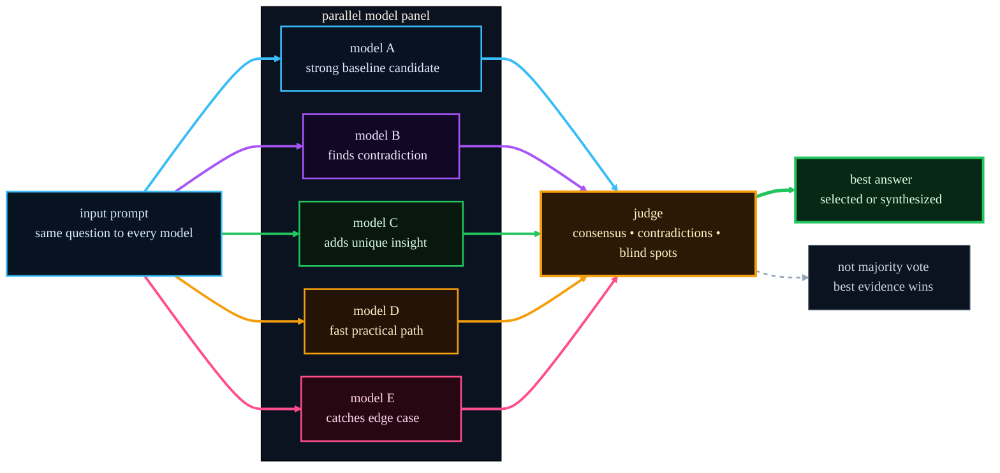

# pi-fusion

[](https://www.npmjs.com/package/@alexeiled/pi-fusion)
[](https://github.com/alexei-led/pi-fusion/actions/workflows/test.yml?query=branch%3Amaster)
[](https://nodejs.org/)
[](./LICENSE)

> Parallel models. One judge. Better answers.

`pi-fusion` is a Pi extension for hard technical questions.
It uses `pi-subagents` to send the same prompt through a small parallel model panel,
then asks a judge agent to compare the outputs and return the best realistic answer.

CI covers lint, typecheck, unit tests, integration tests, package smoke tests,
and `npm pack --dry-run`.


## Why Fusion exists

Hard questions are often bottlenecked by one model's search path.
`pi-fusion` trades latency for diversity:

- the same prompt fans out to several model runs in parallel
- each model explores the problem from a different training prior and reasoning path
- overlap raises confidence
- disagreement exposes risk
- the judge keeps the strongest parts and drops weak, partial, or conflicting ones

This is evidence selection, not majority vote.



## Why a panel can beat one model

Single-model answers are brittle on hard tasks. They are limited by one model's
priors, one reasoning path, and one failure mode.

A panel helps because:

- different models are trained differently and make different bets
- errors are less correlated, so blind spots do not line up perfectly
- consensus is a useful confidence signal without pretending certainty
- disagreement tells you where the answer is fragile
- a judge can select or synthesize the best realistic answer from the set

The result is slower, but usually better for design choices, risk review,
tricky debugging, and research-heavy questions.

## What the judge actually does

The judge gets:

- the original prompt
- every panel output
- panel failures and blind spots
- the configured judge model

It then:

- finds consensus
- preserves real disagreements
- spots weak or incomplete answers
- pulls forward unique insights worth keeping
- returns one clear recommendation and next step

It does not edit files or spawn more subagents. It does one job: choose or
synthesize the best realistic answer.

## Good fit

Use it for questions like:

- Which design should we choose?
- What will break if I change this?
- Is this PR or release flow safe?
- What did I miss?
- What is the right test strategy here?

Do not use it for trivial edits, formatting, or obvious one-step fixes.

## Commands

```text
/fusion
/fusion <prompt>
/fusion --profile <name> <prompt>
/fusion -p <name> <prompt>
/fusion status
/fusion stop
/fusion init
```

## Quick start

Requirements:

- Pi
- Node.js 22.19+
- `pi-subagents`

```bash
pi install npm:pi-subagents
pi install npm:@alexeiled/pi-fusion
```

Then reload Pi:

```text
/reload
```

For commands, config, and troubleshooting details, see [`docs/user-guide.md`](./docs/user-guide.md).

## Notes

- Bare `/fusion` shows a short command summary.
- Config is optional. Defaults work. Use `/fusion init` when you want project config.
- Project config lives at `.pi/fusion.json`. Global config lives at `~/.pi/agent/fusion.json`.
- Output appears as a Pi custom message. Active progress also uses the `fusion` status key.
- Active runs are reconciled from `pi-subagents` lifecycle artifacts, not only completion events.
- `pi-fusion` does not own the footer.
- Prompts and inspected snippets may be sent to your configured model providers through `pi-subagents`.

## Read more

- [`docs/user-guide.md`](./docs/user-guide.md) — commands, config, profiles, privacy, troubleshooting
- [`DEVELOPMENT.md`](./DEVELOPMENT.md) — contributor workflow
