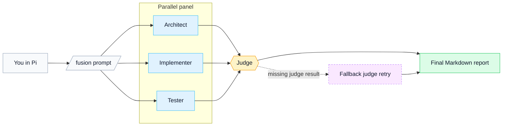

# pi-fusion

[](https://www.npmjs.com/package/@alexeiled/pi-fusion)
[](https://nodejs.org/)
[](./LICENSE)

> Parallel panel. One judge. One report.

`pi-fusion` is a Pi extension for questions that need deliberation, not a guess.
It runs a small panel of read-only subagents in parallel, then asks a judge agent
to synthesize one final Markdown report.

## Fusion model

My approach is simple:

- one hard question becomes a short review panel
- panelists work independently in parallel
- the judge reconciles evidence, not votes
- if the judge result is missing but the panel still produced enough signal,
  Fusion retries only the judge step

This is evidence-first, not majority vote.
The judge is a synthesizer, not a tie-breaker by headcount.



## How the judge works

The judge gets:

- the original prompt
- the panel outputs
- the panel failures and blind spots
- the configured judge model

It produces one report that highlights:

- consensus
- disagreements
- risks
- missing evidence
- next step

It does not edit files or spawn more subagents. It does one job: turn
competing notes into one clear recommendation.

## Good fit

Use it for questions like:

- Which design should we choose?
- What will break if I change this?
- Is this PR or release flow safe?
- What did I miss?
- What is the right test strategy here?

Do not use it for trivial edits, formatting, or obvious one-step fixes.

## Commands

```text
/fusion
/fusion <prompt>
/fusion --profile <name> <prompt>
/fusion status
/fusion stop
/fusion init
```

## Quick start

Requirements:

- Pi
- Node.js 22.19+
- `pi-subagents`

```bash
pi install npm:pi-subagents
pi install npm:@alexeiled/pi-fusion
```

Then reload Pi:

```text
/reload
```

For full config examples and profile details, see [`docs/user-guide.md`](./docs/user-guide.md).

## Notes

- Bare `/fusion` shows a short command summary.
- Config is optional. Defaults work. Use `/fusion init` when you want project config.
- Project config lives at `.pi/fusion.json`. Global config lives at `~/.pi/agent/fusion.json`.
- Output appears as a Pi custom message. Active progress also uses the `fusion` status key.
- Active runs are reconciled from `pi-subagents` lifecycle artifacts, not only completion events.
- `pi-fusion` does not own the footer.
- Prompts and inspected snippets may be sent to your configured model providers through `pi-subagents`.

## Read more

- [`docs/user-guide.md`](./docs/user-guide.md) — commands, config, profiles, privacy, troubleshooting
- [`DEVELOPMENT.md`](./DEVELOPMENT.md) — contributor workflow
